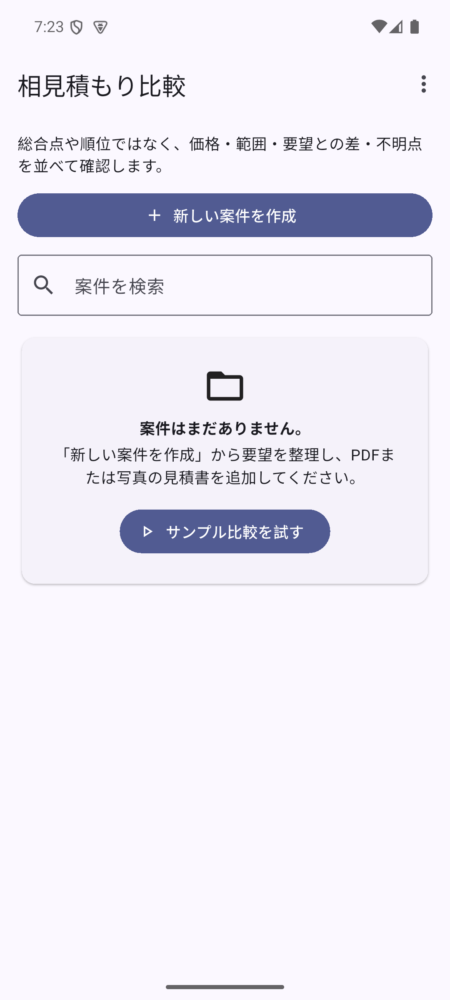
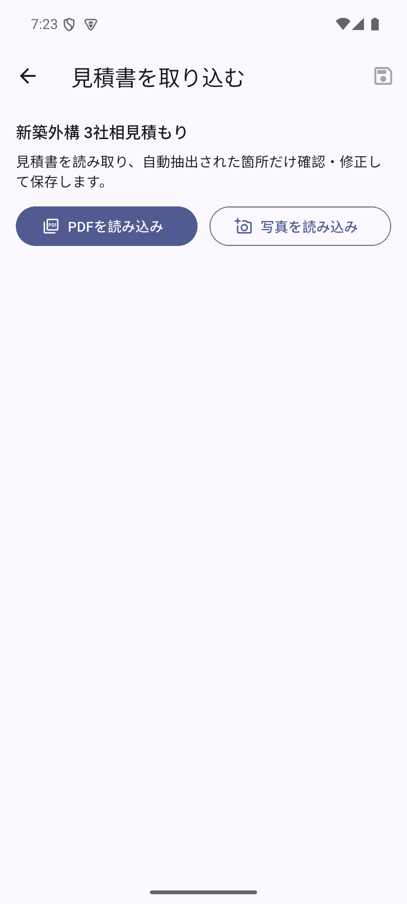
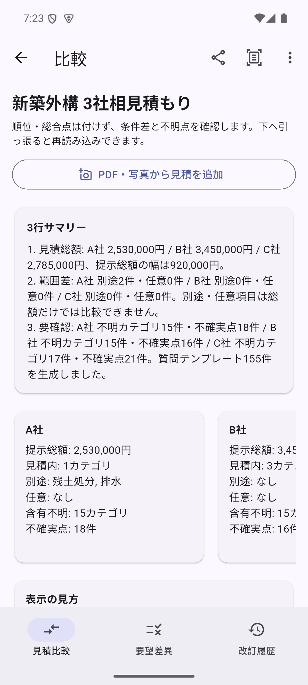

# 相見積もり比較

複数社の見積書を、単純な総合点や順位ではなく、**価格・工事範囲・別途費用・オプション・不明点**の差として整理するFlutterアプリです。

PDFまたは写真から見積書を取り込み、端末内OCRで抽出した内容を確認・修正したうえで、カテゴリ別の比較表と業者への確認質問を作成します。案件・見積・比較結果は端末内のSQLiteに保存されます。

## 主な機能

- 案件の作成、検索、スワイプ削除
- PDF・写真からの見積書取り込み
- OCR結果の確認・修正
- 複数社のカテゴリ別比較
- 別途費用、オプション、不明点の可視化
- 比較結果の共有
- ダークモード
- 端末内データの一括削除

データの保存・OCR・共有・広告の概要は[PRIVACY.md](PRIVACY.md)を参照してください。ストア公開時は、正式なプライバシーポリシーURLを別途用意してください。
公開前の確認項目は[RELEASE_CHECKLIST.md](RELEASE_CHECKLIST.md)にまとめています。

## スクリーンショット

| ホーム | 見積取込 | 比較結果 |
| --- | --- | --- |
|  |  |  |

## セットアップ

### 必要環境

- Flutter SDK（`pubspec.yaml`のSDK制約を満たすバージョン）
- Android Studio、または接続済みAndroid端末
- Android SDK
- Java 17
- GNU Make（Makefileを利用する場合）

### 1. リポジトリを取得

```bash
git clone https://github.com/kaenozu/aimitsumori_app_spec_v0_1.git
cd aimitsumori_app_spec_v0_1
```

### 2. 依存関係を取得

```bash
flutter pub get
```

### 3. アプリを起動

```bash
make run
```

Makeを使用しない場合は、次のコマンドでも起動できます。

```bash
flutter run
```

## 開発用コマンド

| コマンド | 内容 |
| --- | --- |
| `make run` | アプリを起動 |
| `make test` | ユニット・Widgetテストを実行 |
| `make test-integration` | `DEVICE`で指定したデバイス（既定: `windows`）で統合テストを実行 |
| `make analyze` | 静的解析を実行 |
| `make icons` | ランチャーアイコンを生成 |
| `make splash` | ネイティブスプラッシュを生成 |
| `make build-apk` | 開発用Debug APKを作成 |
| `make build-release-apk` | 本番設定を使ってRelease APKを作成 |
| `make audit-release-apk` | Release APKのパッケージ、AdMobテストID、署名を監査 |
| `make release-prep` | アイコン・スプラッシュ生成、解析、テスト、APK作成を順番に実行 |

## テストと静的解析

```bash
make analyze
make test
```

Androidエミュレーターまたは実機で統合テストを実行する場合:

```bash
make test-integration DEVICE=emulator-5554
```

Windowsで実行する場合は`make test-integration`（`DEVICE=windows`）を使用します。接続先が複数ある場合は、必ず`DEVICE`を明示してください。

## リリースビルド

Android向けの開発用APKを作成します。

```bash
make build-apk
```

生成物は通常、`build/app/outputs/flutter-apk/app-release.apk`に出力されます。

Google Play提出用にはAABを使用します。

### 本番リリースの必須設定

本番ビルドは、debug署名やAdMobのテストIDでは作成できません。

1. `android/key.properties.example`を`android/key.properties`へコピーし、リリース用keystoreの情報を設定します。
2. 本番AdMobアプリIDと広告ユニットIDを環境変数から渡します。
3. Google Playの広告削除商品IDを`REMOVE_ADS_PRODUCT_ID`で渡します。

iOSで広告を有効にする場合は、`ios/Runner/Info.plist`の`ADMOB_APP_ID`ビルド設定に本番AdMobアプリIDを渡し、`ADMOB_IOS_BANNER_ID`と`ADMOB_IOS_REWARDED_ID`を`--dart-define`で渡します。未設定のまま本番広告を初期化しないでください。

AndroidのReleaseビルドでは、AdMob IDは`ca-app-pub-...`形式、課金商品IDはGoogle Playで作成した商品ID形式であることも検証されます。

```powershell
$env:ADMOB_APP_ID='ca-app-pub-XXXXXXXX~YYYYYYYY'
$env:ADMOB_ANDROID_BANNER_ID='ca-app-pub-XXXXXXXX/BBBBBBBB'
$env:ADMOB_ANDROID_REWARDED_ID='ca-app-pub-XXXXXXXX/RRRRRRRR'
$env:REMOVE_ADS_PRODUCT_ID='remove_ads_pro'
.\tool\build_android_release.ps1 -Artifact appbundle
```

スクリプトが環境変数を検証し、GradleとDartの両方へ同じ値を渡します。署名情報、本番広告ID、または課金商品IDが未設定・不正の場合は、ビルドを意図的に停止します。
生成物は通常、`build/app/outputs/bundle/release/app-release.aab`に出力されます。

APKのAdMob Application IDと本番設定値まで照合する場合は、次のように指定します。

```powershell
.\tool\audit_android_release.ps1 -ExpectedAdMobAppId $env:ADMOB_APP_ID
```

アイコンやスプラッシュ素材を変更した場合は、ビルド前に次を実行してください。

```bash
make icons
make splash
```

## アーキテクチャ概要

### Models

- `lib/models.dart`
- 案件、業者見積、明細、比較結果、確認質問などのドメインモデルを定義します。

### Repositories

- `lib/repositories/project_repository.dart`
- UIとSQLite実装の間に入り、案件・見積・比較結果の保存操作をまとめます。

### Services

- `lib/services/database_service.dart`: SQLiteへの永続化
- `lib/services/ocr_service.dart`: PDF・画像からのOCR処理
- `lib/services/ad_service.dart`: 広告表示と広告削除課金
- `lib/services/comparison_export_service.dart`: 比較結果の共有テキスト生成
- `lib/services/app_preferences.dart`: ダークモード設定の保存
- `lib/services/haptic_service.dart`: 主要操作の触覚フィードバック

### Screens

- `lib/screens/onboarding_screen.dart`: 初回案内とサンプルデータ登録
- `lib/screens/home_screen.dart`: 案件一覧、検索、スワイプ削除、設定画面への導線
- `lib/screens/quote_input_screen.dart`: PDF・写真の取込と抽出結果の確認
- `lib/screens/comparison_screen.dart`: カテゴリ別比較と確認質問の表示
- `lib/screens/settings_screen.dart`: テーマ、アプリ情報、全データ削除

比較ロジックは`lib/normalizer.dart`、`lib/comparison_engine.dart`、`lib/question_generator.dart`に分離されています。
